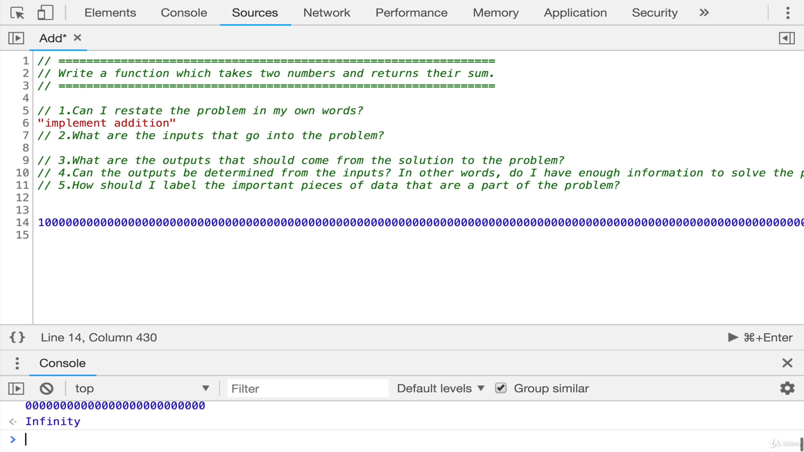

# Step1: Understand The Problem

## Don't try to solve problems as soon as you see it!!

## Before you start typing or Whiteboarding,

- Take a step back
- Make Sure you understand the task ahead of you
- There are some deliberate questions you can ask
- A thorough investigation of the problem or a question and it can really help clarify things and sometimes it will give you a "aha" moment.

## Here are some of the questions that you can ask yourself or interviewer

1. Can I restate the problem in my own words?

   > This is always the first thing that the instructor ask his studetns to do in an interview setting

2. What are the inputs that go into the problem?
3. What are the outputs that should come from the solution to the problem?
4. Can the outputs be determined from the inputs?
   > In other words, do I have enough information to solve the problem?

> You may not be able to answer this question until you set about solving the problem.

5. How should I label the importatnt pieces of data that are a part of the problem?

## Imagine someone asked you this:

### "Write a function which takes two numbers and returns their sum"

1. Can I restate the problem in my own words?

   > **Implement Addition**

2. What are the inputs that go into the problem?

- Are we talking about **integer numbers**?
- Are we talking about **floating point** exclusively?
- How large these numbers are going to be?
  > Because in some languages there's an upper bound for the size for numbers

It shows you infinity.

- Are we only working with two inputs?
  > What if someone wants to add four ten numbers?

3. What are the outputs that should come from the solution to the problem?

   > Should it be the **integer? float?**

4. Can the outputs be determined from the inputs?

- In most cases the answer would be yes!
- But what if someone only passes one number..
  > So do we add zero? do we return **undefined,null** ?

5. How sohuld I label the important pieces of data?

- We can name our function "add" and then we'll have number one and nuber two is the arguments and then SUM is our result that we return
