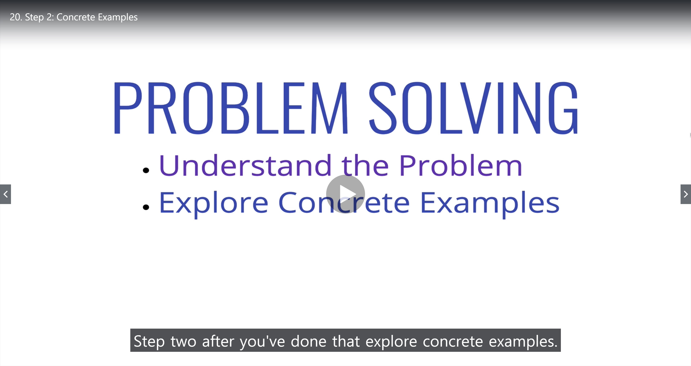
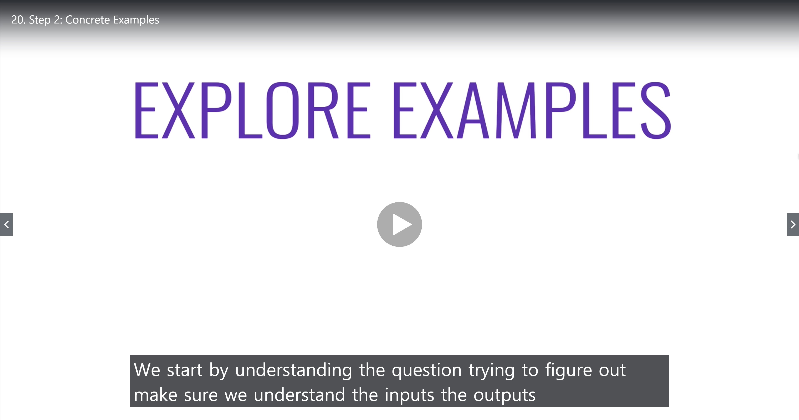
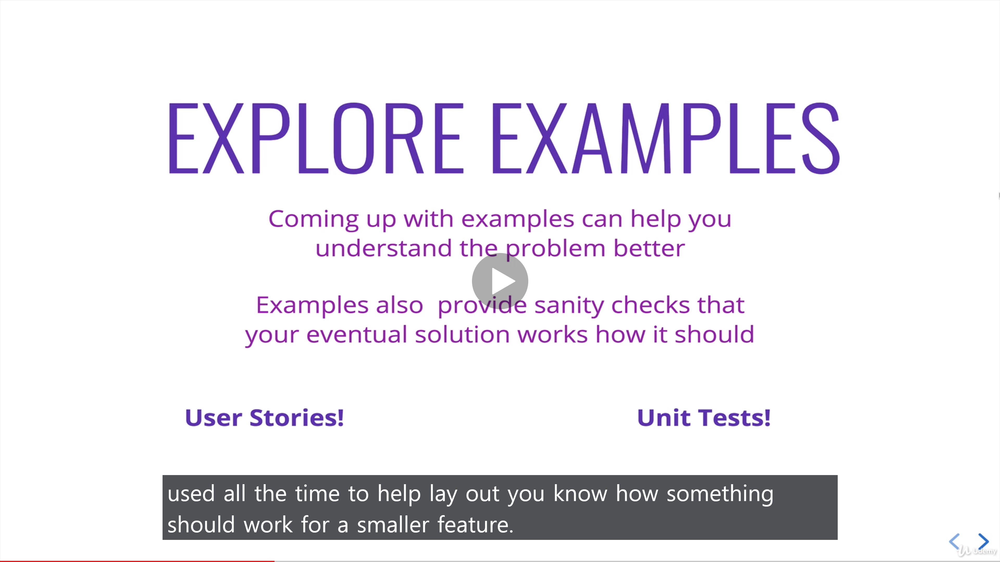
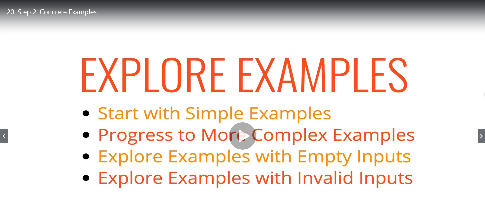
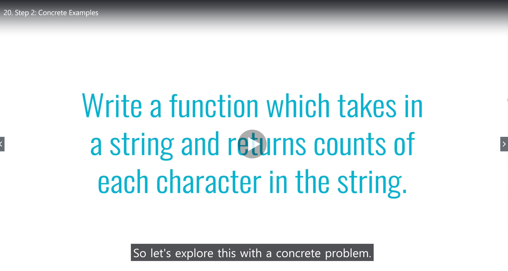
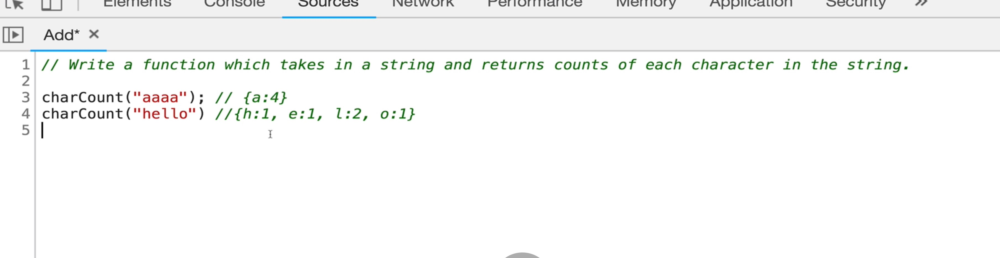

# Step2. Concrete Examples

### Once you understand the problem, then explore concrete examples!!

 

### **Let's start with a simple example!**

 

### **Ask questions.**

- Should it just return the letters that are in ther?
- What about the letters that arent't there?
  > e.g) {a:4, b:0, c:0} .. Because if we did that it might make our code a lot easier if every letter was already in there set to 0

 

### **Progress to More Complex Examples**

- What if... "my phone number is 00022134"
- If this was an input... what would we expect to return?
- Do we account for spaces??
- What about other signs such as dollar signs, underscore, numbers...?

What abuot this???

- "Hello hi"
- Do we store uppercase H and lowercase h ? do we ignore casing??

### _These examples are just another form of understanding the problem better before we tackle it!_

 

### **Explore Examples with Empty Inputs**

- What if somebody does charCount() that doesn't pass anything like that?
- or charCount(" ")

- What do we want to return?? Do we want to return an empty object at the end? {}?
- or do we want to return "null" or "false" or "undefined" or maybe an "error"?

 

## Explore Examples with Invalid Inputs

- what if somebody passes in something that isn't a string?
- they pass in a number where they pass in an object?

### There's all sorts of these edge cases.
