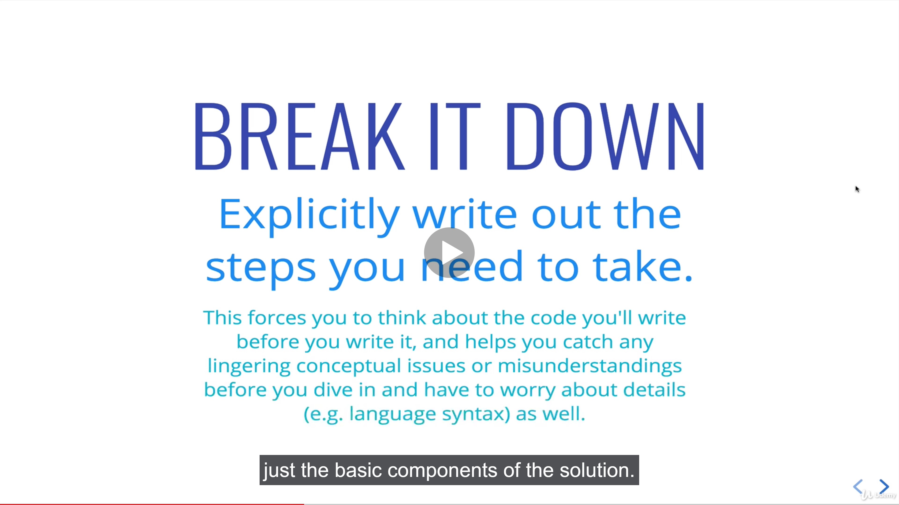
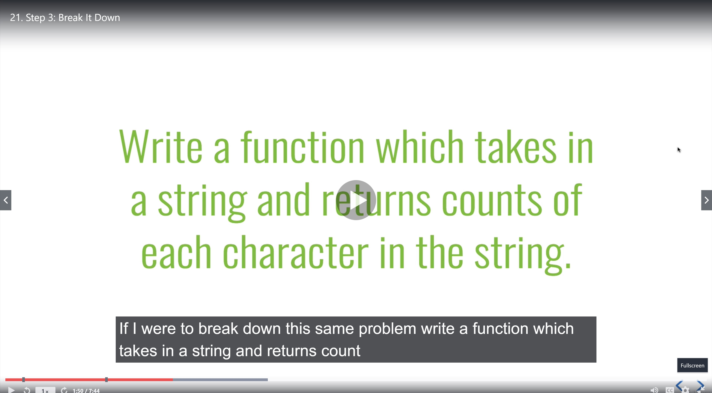
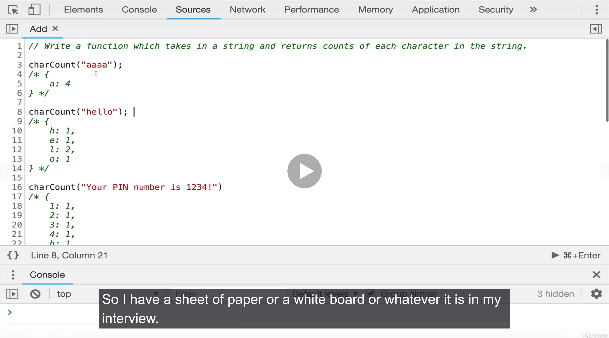
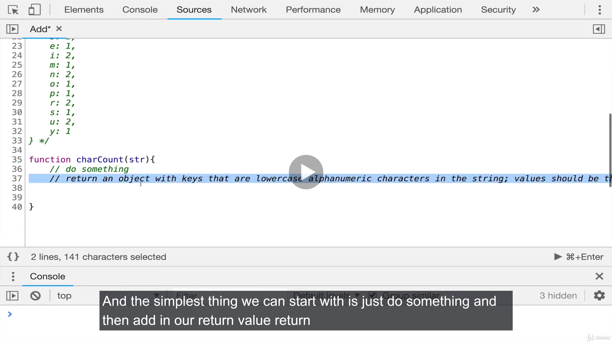
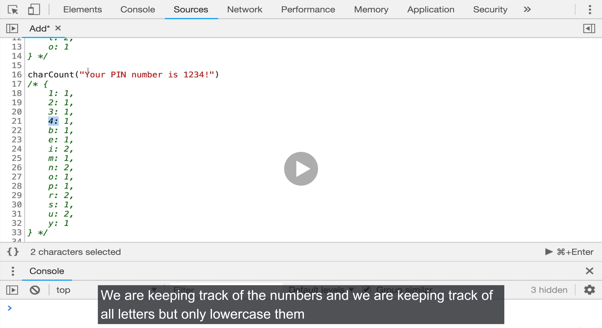
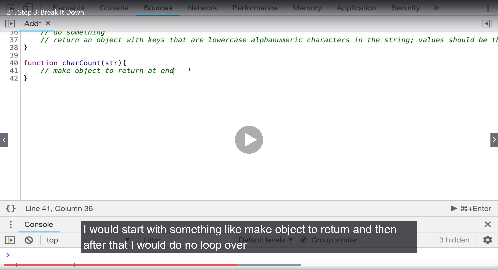
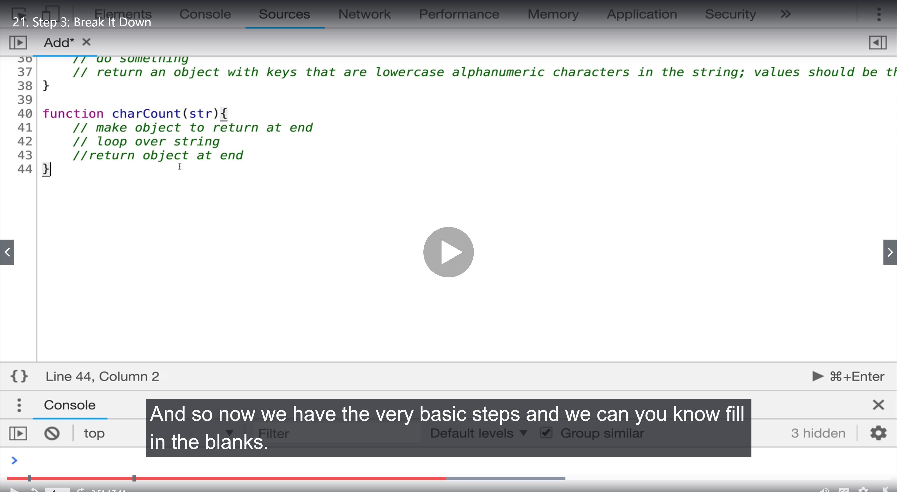
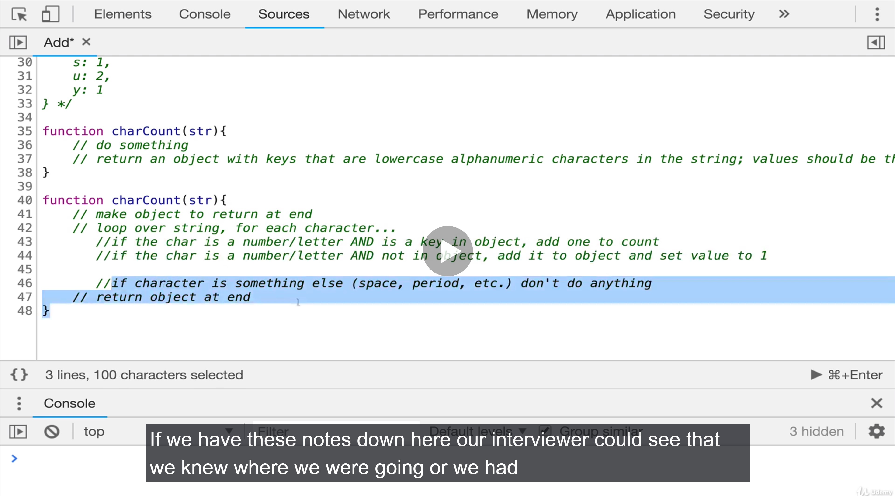

# Step 3. Break It Down

### Take the actual steps of the problem and write them down

- A lof of interviewers are looking for is you to communicate what you're doing

- You don't want to just start typing right away or start writing code on a white board silently

- IT'S MUCH BETTER TO SAY "All right here's the steps I'm going to try and take"

- 'Could this be the right way fo doing it? Sometimes they'll give you a little hint

### It doesn't have to be a ton of detail, it doesn't have to be a line by line.

- Just to clarify I / my interviewer decided that we only need to care about alphanumeric charaters lowercase as well

> "Let's ignore casing matters, spacing too!

- The bluk of the logic involves looping over every character in the string and doing something.

- Make object to return at end
- Loop over string, for each character..
- if the char a number/ letter AND is a key in object, add one to count
- if the char is a number/letter AND not in our object, add it and set value to 1
  > We are not gonna add "space" and "exclamation point"
- if character is something else (space, period, etc) DON'T DO ANYTHING!

