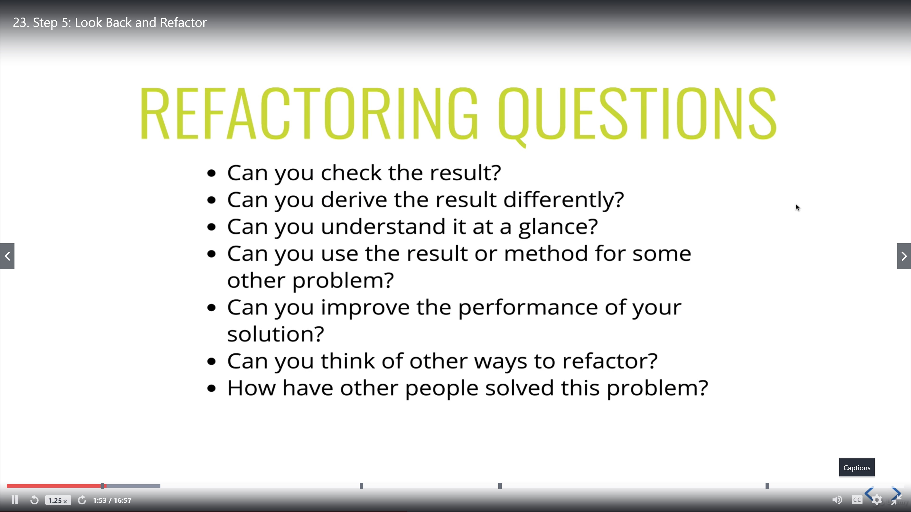
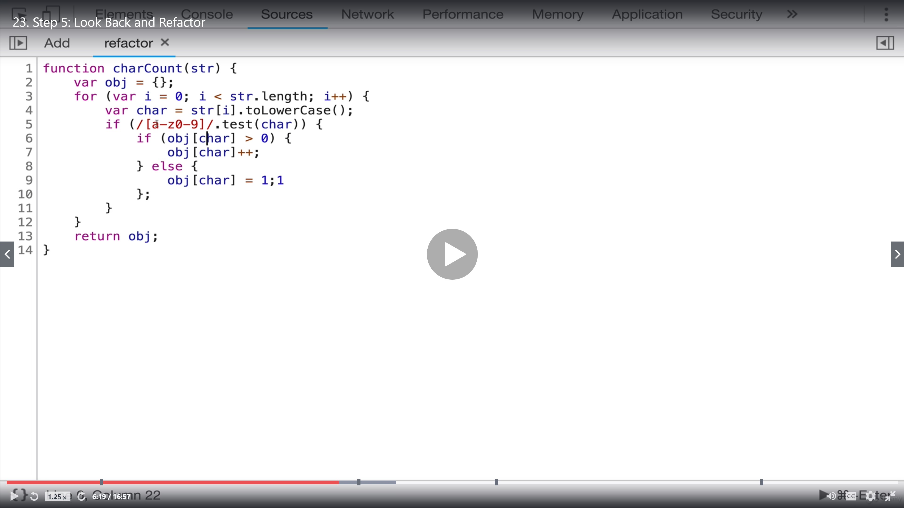
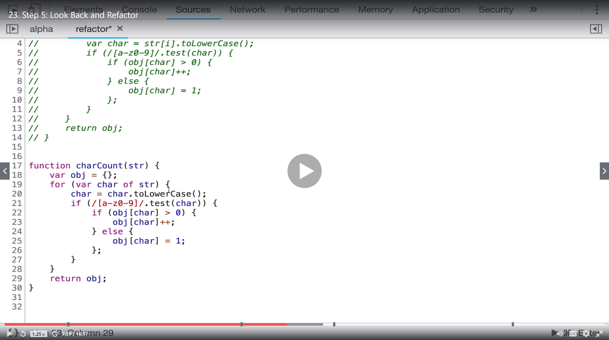
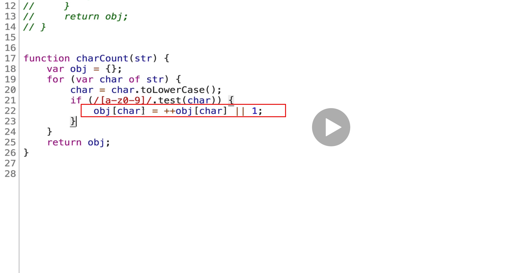
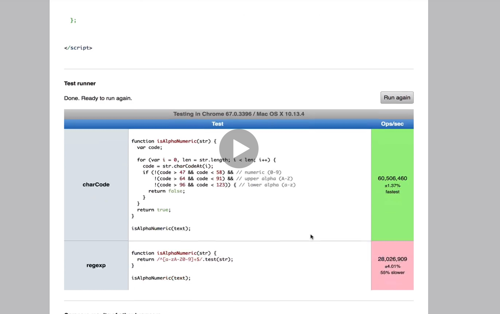
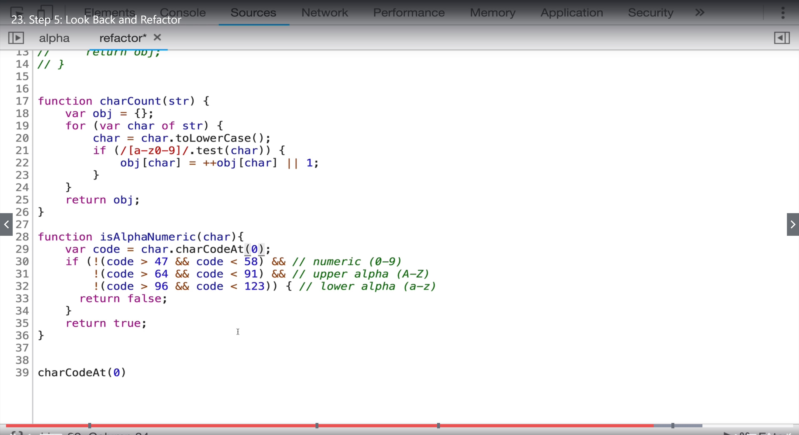
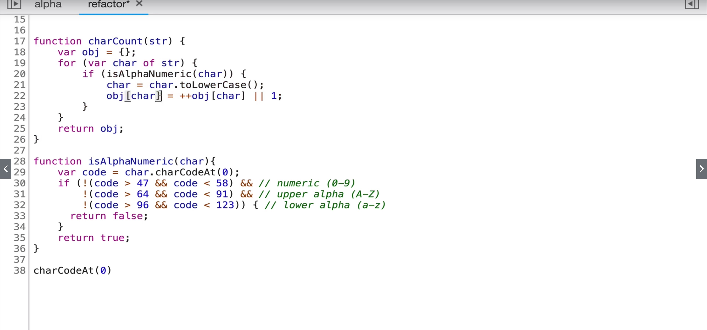
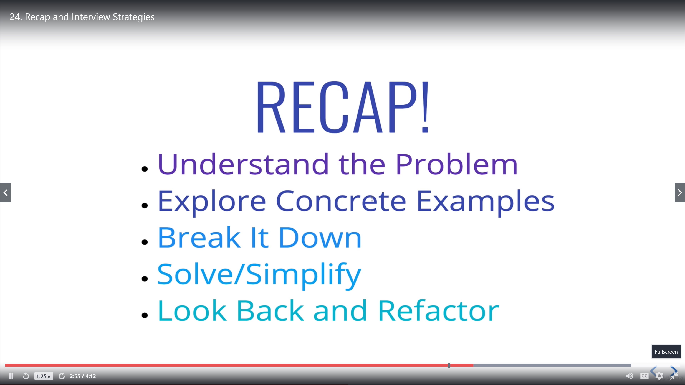

# Step5 Look Back and Refactor

## Refactor : Regex

## Refactor again : for of loop

## Make If statement simpler

## charCode

## Change regex to charCode

## Move the "toLowerCase" in the if statement

